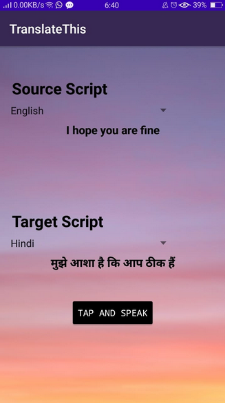

	
	<h1>TranslateThis :computer:</h1>

<h3>TranslateThis: Android App developed for MCAN Lab</h3>
We used Firebase ML Kit text translate for Language Translation.

<b>Ask for Permission to Record Audio</b>

<b>Downloads and stores the Model required locally for the first time, thus improves Response Time during next test runs.</b>

<b>Final Demo:</b>

